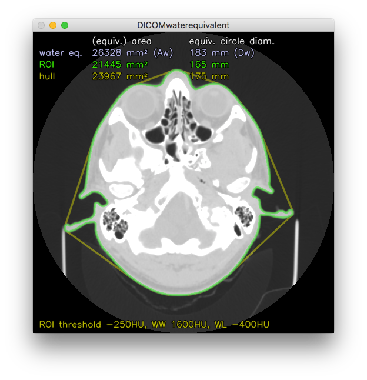

# DICOMwaterequivalent
Python script to calculate water equivalent area (_A<sub>w</sub>_), water equivalent circle diameter (_D<sub>w</sub>_) and effective diameter, for 16 bit CT DICOM images, as proposed by AAPM Task Groups 204 and 220 for calculating patient size for size-specific dose estimates (SSDE) in CT. _A<sub>w</sub>_ and _D<sub>w</sub>_ consider tissue attenuation, while effective diameter only describes the patient geometry.

This script can be used as a standalone script or included as a function.

> **N.b.**: visually inspect the output image for correct ROI placement. The ROI should be a tight fit around the entire patient and not include any air, CT table, clothing, implants, ECG leads etc. ROI fit is influenced by the specified ROI contour threshold. Exclusion of implants is not (yet) possible with this script. <TODO: link to article discussing suitable threshold range> 

#### SSDE factors
SSDE conversion factors can be calculated from _D<sub>w</sub>_ depending on the phantom used for CTDI<sub>vol</sub> estimation:

> For 32 cm phantoms
> 
>     conversion factor = 3.704369 * e^(-0.03671937*Dw)
>
> For 16 cm phantoms
> 
>     conversion factor = 1.874799 * e^(-0.03871313*Dw)
> 
> _(Source: AAPM Report 204. Note that it reports _D<sub>w</sub>_ as 'effective diameter', as clarified in Report 220)_

## Requirements
cv2, numpy, pydicom

    $ pip3 install opencv-python numpy pydicom

## Python function
### Usage

    >>> import DICOMwaterequivalent
    >>> DICOMwaterequivalent(filename, threshold, window)

* filename:  DICOM file,
* threshold: ROI contour threshold level in HU,
* window:    Optional, view window for output image, as tuple (ww,wl). No image will be outputted if omitted.

### Returns
Tuple containing:
1.  water equivalent area _A<sub>w</sub>_ in mm² (float),
2.  water equivalent diameter _D<sub>w</sub>_ in mm (float),
3.  ROI area in mm² (float),
4.  ROI equivalent circle diameter in mm (float),
5.  ROI hull area in mm² (float),
6.  ROI hull equivalent circle diameter in mm(float),
7.  image displaying ROI and ROI hull contours (numpy array).

### Example

    >>> import DICOMwaterequivalent
    >>> equiv = DICOMwaterequivalent('480.0.dcm', -250, (1000,40))
    >>> print(equiv)
    ( 24740.231323242188, 
      177.48307205659782, 
      27518.49097592727,
      187.18341518945613,
      25731.055450439453,
      181.0022025481258,
      array([[[0, 0, 0], ... ]]], dtype=uint8))
    )
    >>> cv2.imwrite('out.png', equiv[6])

## Standalone use
### Usage

    ./DICOMwaterequivalent.py <filename> <threshold>

* filename:  DICOM file
* threshold: ROI contour threshold level in HU

### Output
##### Console
```
(
	water equivalent area _A<sub>w</sub>_ in mm² (float),
	water equivalent diameter _D<sub>w</sub>_ in mm (float),
	ROI area in mm² (float),
	ROI equivalent circle diameter in mm (float),
	ROI hull area in mm² (float),
	ROI hull equivalent circle diameter in mm (float)
)
```

##### Graphic
image displaying ROI and ROI hull contours

### Example

    $ ./DICOMwaterequivalent.py 480.0.dcm -250
    (24740.231323242188, 177.48307205659782, 27518.49097592727, 187.18341518945613, 25731.055450439453, 181.0022025481258)

<br clear="all" />
* Example source image courtesy of Patient Contributed Image Repository patient 54879843, available from http://www.pcir.org/researchers/downloads_available.html

## More information
McCollough C, Bakalyar DM, Bostani M, Brady S, Boedeker K, Boone JM, Chen-Mayer HH, Christianson OI, Leng S, Li B, McNitt-Gray MF. [Use of water equivalent diameter for calculating patient size and size-specific dose estimates (SSDE) in CT: The Report of AAPM Task Group 220.](https://www.ncbi.nlm.nih.gov/pmc/articles/PMC4991550/) AAPM report. 2014 Sep;2014:6.

Boone JM, Strauss KJ, Cody DD, McCollough CH, McNitt‐Gray MF, Toth TL. [Size‐Specific Dose Estimates (SSDE) in Pediatric and Adult Body CT Examination.](https://www.aapm.org/pubs/reports/rpt_204.pdf) College Park, MD: American Association of Physicists in Medicine; 2011.
